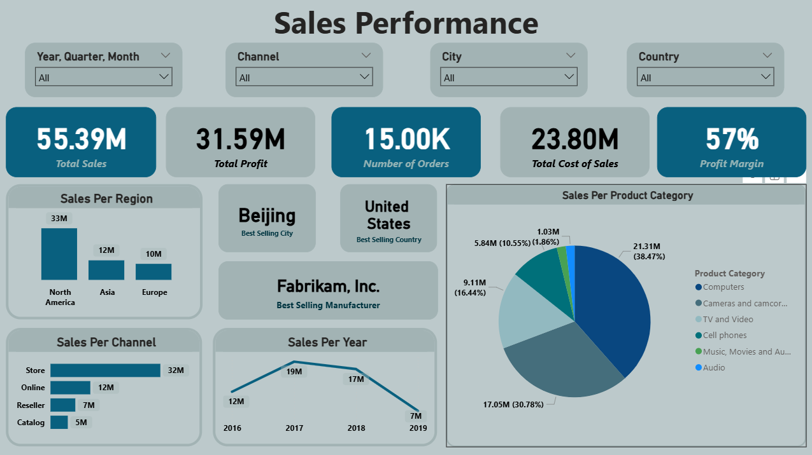

# 🌍 Global Sales & Profitability Analysis (Power BI)

## 📌 Project Overview
This project involves a comprehensive data analysis of a global retail corporation's sales and profitability. The primary business objective is to evaluate financial health, identify the most lucrative revenue streams (channels and product categories), and pinpoint areas for geographical growth. A dynamic Power BI dashboard was developed to empower stakeholders to track performance metrics across multiple years and regions.

## 🗂️ Data Structure & Attributes
The analysis is built upon a robust dataset tracking **15,000 orders** from 2016 to 2019. Key data attributes modeled in this project include:
* **Financial Metrics:** Total Sales, Total Cost of Sales, Total Profit, and Profit Margin.
* **Geographical Data:** Region (North America, Asia, Europe), Country, and City.
* **Product Hierarchy:** Product Category (Computers, Cameras, Cell Phones, etc.) and Manufacturer.
* **Operational Data:** Sales Channels (Store, Online, Reseller, Catalog) and Time periods (Year, Quarter, Month).

## 📊 Interactive Dashboard Snapshot

## 🎯 Executive Summary (KPIs)
The dashboard provides a high-level executive view with the following critical KPIs:
* **Total Sales Revenue:** $55.39 Million
* **Total Profit:** $31.59 Million
* **Overall Profit Margin:** 57% (Indicating a highly healthy pricing and cost-control strategy).
* **Total Cost of Sales:** $23.80 Million
* **Order Volume:** 15.00K Orders

## 💡 Deep-Dive Business Insights

### 1. Financial Health & Profitability
The operation maintains a strong profit margin of **57%**. Generating $31.59M in profit from $55.39M in sales shows high-value product offerings and efficient supply chain management.

### 2. Geographical Dominance vs. Localized Spikes
* **Regional Dominance:** **North America** is the undisputed leading market, generating **$33M** (more than Asia and Europe combined).
* **Interesting Anomaly:** While the **United States** is the highest-grossing country, **Beijing** emerged as the best-selling individual city. This indicates a highly concentrated and successful market penetration in specific Asian metropolitan areas, despite the overall region lagging behind North America.

### 3. Sales Channel Strategy
* **Physical vs. Digital:** Traditional brick-and-mortar **Stores** remain the primary revenue driver, contributing **$32M**. 
* **Opportunity:** The **Online** channel is the second largest ($12M). Given global digital shifts, this represents a significant area for future investment and aggressive marketing to reduce dependency on physical stores.

### 4. Product Portfolio Analysis
* The company is heavily reliant on consumer electronics. **Computers** ($21.31M | 38.47%) and **Cameras/Camcorders** ($17.05M | 30.78%) together account for nearly **70%** of all global sales. 
* **Fabrikam, Inc.** was identified as the most valuable manufacturing partner in the portfolio.

### 5. Time-Series Trends & Concerns
* The "Sales Per Year" trend reveals a significant growth from 2016 ($12M) to a peak in 2017 ($19M). 
* **Area for Investigation:** There is a noticeable downward trend observed moving into 2018 ($17M) and a sharp drop in 2019 ($7M). Stakeholders must investigate external market factors, increased competition, or supply chain disruptions during this period.

## 🛠️ Tools, Technologies & Techniques
* **Tool:** Microsoft Power BI (`.pbix`).
* **Data Modeling:** Established relationships between Sales fact tables and dimension tables (Time, Geography, Product).
* **DAX (Data Analysis Expressions):** Created custom measures for precise calculations of *Profit Margin %* and YoY (Year-over-Year) growth indicators.
* **UI/UX:** Designed a clean, dark-themed interface with dynamic slicers for deep-dive filtering.

## 🚀 How to Use This Repository
1. Download the `Sales Performance.pbix` file.
2. Open it using **Power BI Desktop**.
3. Use the top slicers (`Year, Quarter, Month`, `Channel`, `City`, `Country`) to interact with the data and uncover localized insights.
